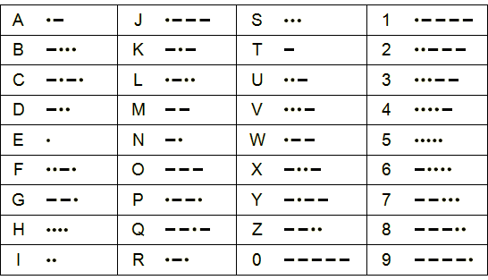

[](https://pypi.python.org/pypi/morse-talk/)
[](https://travis-ci.org/morse-talk/morse-talk)
[](https://landscape.io/github/morse-talk/morse-talk/master)
[](http://morse-talk.readthedocs.org/?badge=latest)
[](https://github.com/morse-talk/morse-talk/issues)


# Morse Talk
Morse Talk is a Python library which deals with [Morse code](http://en.wikipedia.org/wiki/Morse_code)

## Installation

### Using pip
```sh
pip install morse-talk
```

### Development version
```sh
git clone https://github.com/OrkoHunter/morse-talk.git
cd morse-talk/
python setup.py install
```

## Examples
```python
>>> import morse_talk as mtalk
```
# Encoding in morse
```python
>>> mtalk.encode('Alpha Ranger 45 departed')
'.-   .-..   .--.   ....   .-       .-.   .-   -.   --.   .   .-.       ....-   .....
       -..   .   .--.   .-   .-.   -   .   -..'
```

# Encoding using binary pattern
```python
>>> mtalk.encode('Alpha Ranger 45 knocked down', encoding_type='binary')
'101110001011101010001011101110100010101010001011100000001011101000101110001110100011101110100010001011101000000010101010111000101010101000000011101011100011101000111011101110001110101110100011101011100010001110101000000011101010001110111011100010111011100011101'
```

# Decoding a code encoded in morse
```python
>>> code = '-...   ---   --   -...       -..-       .--.   --'
>>> mtalk.decode(code)
'BOMB X PM'
```

# Decoding a binary pattern
```python
>>> s_bin = mtalk.encode('Alpha Ranger 45 knocked down', encoding_type='binary')
>>> mtalk.decode(s_bin, encoding_type='binary')
'ALPHA RANGER 45 KNOCKED DOWN'
```

## Morse Code
Morse code is a method of transmitting text information as a series of on-off
tones, lights, or clicks that can be directly understood by a skilled listener 
or observer without special equipment. The International Morse Code encodes the
ISO basic Latin alphabet, some extra Latin letters, the Arabic numerals and a 
small set of punctuation and procedural signals as standardized sequences of 
short and long signals called "dots" and "dashes", or "dits" and "dahs". 
Because many non-English natural languages use more than the 26 Roman letters, 
extensions to the Morse alphabet exist for those languages.



International Morse code is composed of five elements:

* short mark, dot or "dit" (·) : "dot duration" is one time unit long
* longer mark, dash or "dah" (–) : three time units long
* inter-element gap between the dots and dashes within a character : one dot duration or one unit long
* short gap (between letters) : three time units long
* medium gap (between words) : seven time units long


